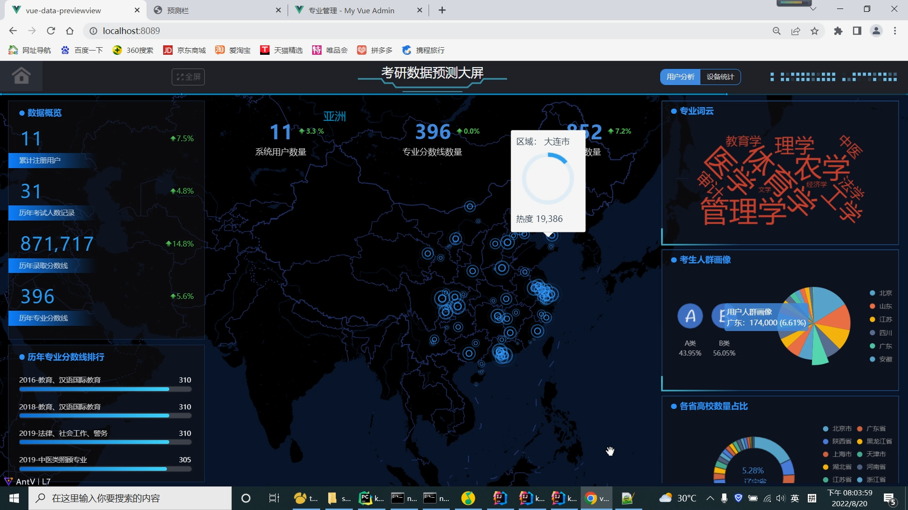
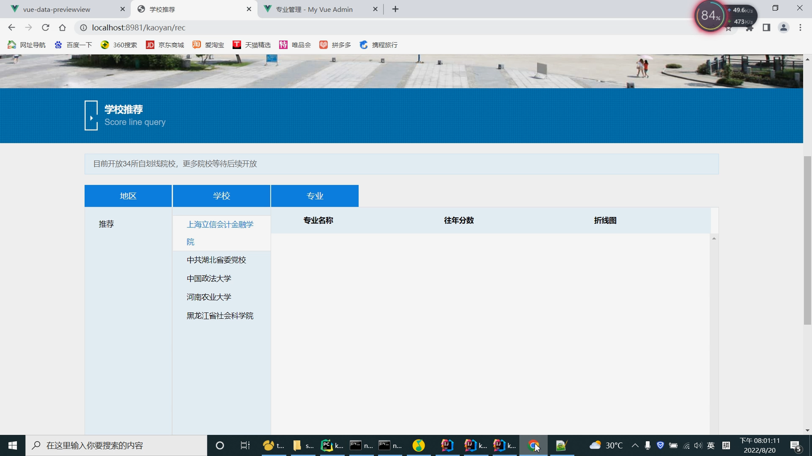

## 计算机毕业设计之Python+Spark+Flink考研测与推荐系统 考研爬虫可视化 考研大数据分析 考研推荐系统  考研预测系统 

## 要求
### 源码有偿！一套(论文 PPT 源码+sql脚本+教程)

https://www.bilibili.com/video/BV1SS4y1W7aN?spm_id_from=333.999.0.0

### 
### 加好友前帮忙start一下，并备注github有偿获取源码
### 我的QQ号是798059319或者 1679232425

# 

### 加qq好友说明（被部分 网友整得心力交瘁）：
    1.加好友务必按照格式备注
    2.避免浪费各自的时间！
    3.当“客服”不容易，repo 主是体面人，不爆粗，性格好，文明人。

# 资料

# 开发技术
前端：vue.js

后端：springboot+mybatis-plus

数据库：mysql

算法(机器学习、深度学习)：协同过滤算法(基于用户、基于物品全部实现)、KNN

爬虫：python、requests、chrome_driver

大数据分析：spark、echarts

# 特色/创新点
结合百度地图api展示大学地理位置信息；

通过KNN等机器学习深度学习算法进行预测；

通过协同过滤算法(基于用户+基于物品全实现)推荐院校；

通过Spark完成大数据大屏显示；

通过Python的requests、chrome_driver爬取数据

# 版本区别
一共开发了三个版本

V1.0.0：只有门户系统(预测算法)

https://www.bilibili.com/video/BV1aq4y1m7U3?spm_id_from=333.999.0.0

V3.0.0：门户系统(预测算法+推荐算法[只有基于用户])+大屏系统+后台管理系统，并且没法更新最新数据

https://www.bilibili.com/video/BV12m4y197JM?spm_id_from=333.999.0.0

V3.0.0：门户系统(预测算法+推荐算法[基于用户+基于物品全实现])+大屏系统+后台管理系统+爬虫，实时更新最新数据

https://www.bilibili.com/video/BV1SS4y1W7aN?spm_id_from=333.999.0.0

# 运行截图

# 运行视频(B站)

https://www.bilibili.com/video/BV1SS4y1W7aN?spm_id_from=333.999.0.0

